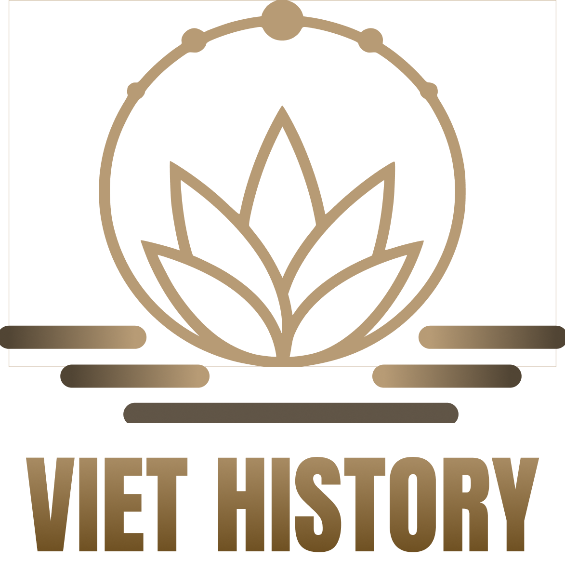

# 🌌 **Viet History**



## Dive into Vietnam’s rich and untold history with **Viet History**. Our app offers detailed insights into Vietnamese historical events and engaging content designed to make history fascinating for everyone.

## 🗂 **Table of Contents**

- [📜 Viet History](#)
  - [🗂 Table of Contents](#table-of-contents)
  - [🌍 About](#about)
  - [⭐ Features](#features)
    - [📖 Historical Content](#historical-content)
    - [🔖 Bookmark Feature](#bookmark-feature)
    - [✨ Recommended Articles](#recommended-articles)
  - [🚀 Future Plans](#future-plans)
  - [📸 Screenshots](#screenshots)
  - [📱 Demo App](#demo-app)
  - [⚙️ Getting Started](#getting-started)
    - [🛠 Prerequisites](#prerequisites)
    - [📥 Installation](#installation)

---

## 🌍 **About**

Discover Vietnam's rich and diverse history with **Viet History**. This app presents stories and events not commonly found in textbooks or other platforms. Our aim is to engage students, history enthusiasts, and learners worldwide by making Vietnam’s history accessible, interesting, and educational.

---

## ⭐ **Features**

- [📖 Historical Content](#historical-content)
- [🔖 Bookmark Feature](#bookmark-feature)
- [✨ Recommended Articles](#recommended-articles)

### 📖 **Historical Content**

- **40+ Articles**: Explore over 40 in-depth articles covering Vietnam’s historical events, culture, and politics from all dynasties.
- **Unique Topics**: Discover lesser-known stories and events from Vietnam’s long history that are rarely covered in traditional sources.
- **Wide range of images**: The app features a rich collection of historical images, making the learning experience more engaging and visually immersive for users.

### 🔖 **Bookmark Feature**

- **Save Favorite Articles**: Easily bookmark your favorite historical articles or events to revisit them anytime.
- **Organized Learning**: Keep track of your learning progress by saving specific sections of content you want to explore further.
- **Quick Access**: Return to previously saved content quickly without having to search for it again.

### ✨ **Recommended Articles**

- **Personalized Suggestions**: Get recommended articles based on your reading history and interests to help you discover new topics.
- **Curated Content**: Find curated lists of articles that are relevant to the period or events you're studying, helping you dive deeper into Vietnam's history.
- **User Engagement**: Stay engaged with fresh content that matches your interests, making history learning more dynamic and personalized.

---

## 🚀 **Future Plans**

We have exciting plans to expand **Viet History** beyond Vietnam’s borders and offer even more engaging content for users:

- **World History**: Our goal is to introduce world history topics, offering users a broader perspective on global events and historical movements.
- **Interactive Games**: We plan to incorporate educational games into the app to make learning history more interactive and enjoyable. These games will challenge users to apply their knowledge in creative ways.
- **Enhanced Learning Tools**: We aim to implement features like quizzes, flashcards, and timelines to improve the learning experience for users of all ages.

---

## 📸 **Screenshots**

<div align="center">
  
  
  
  
  
  
  
</div>

---

## 🎬 **Demo App**

### [DEMO - DRIVE](https://drive.google.com/drive/folders/1oxnCy_Aw9R8-WAmKdGx_LX93s7nnlSsE)

## ⚙️ **Getting Started**

### 🛠 **Prerequisites**

Make sure you have these tools installed before starting:

- **[Node.js](https://nodejs.org/en/)** (v14+)
- **[Expo](https://docs.expo.dev/get-started/installation/)** CLI
- **[Yarn](https://classic.yarnpkg.com/lang/en/docs/install/#mac-stable)**

### 📥 **Installation**

1. **Clone the repository**:

   ```bash
   git clone https://github.com/lhtminh/app-history.git
   cd app-history
   ```

2. **Install dependencies**:

   ```bash
   yarn
   ```

3. **Start the app**:
   ```bash
   yarn start
   ```
