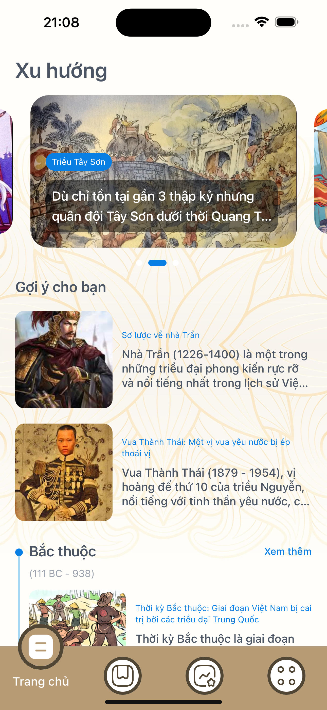
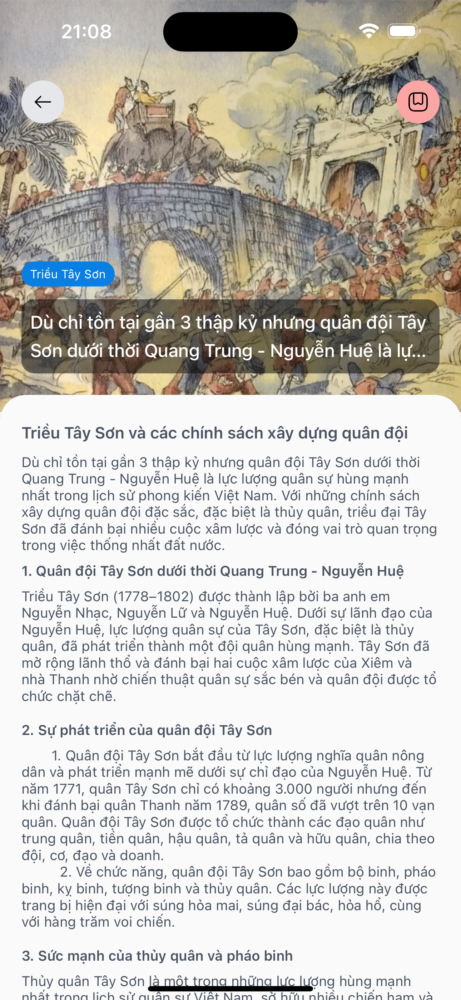
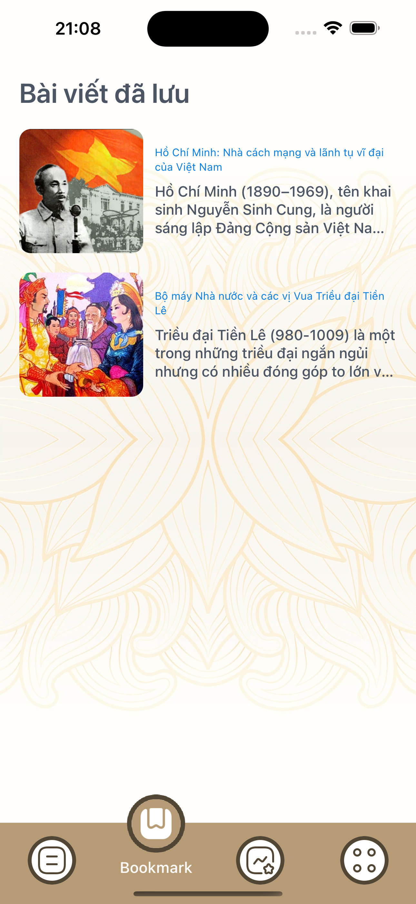
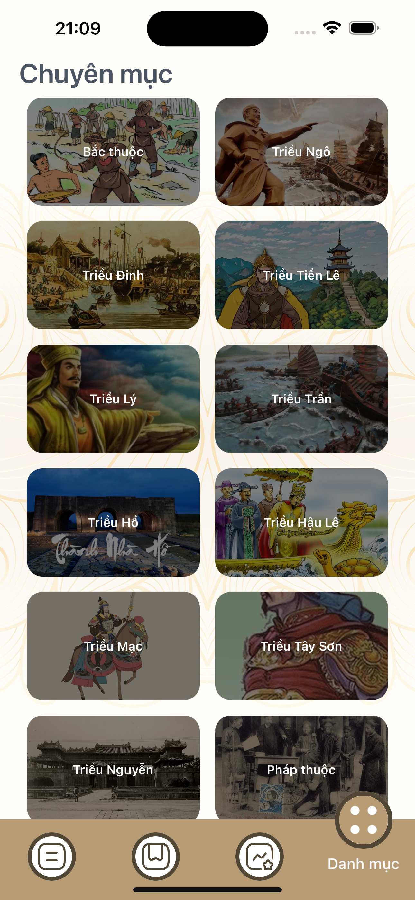
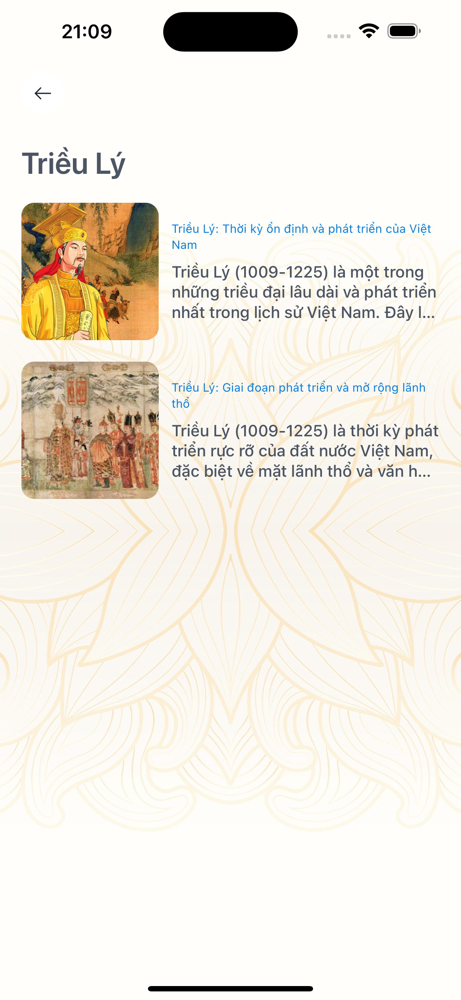

# 🌌 **Viet History** 


Explore the cosmos like never before! Our **Viet History** offers detailed planet information, quizzes to challenge your knowledge, and a fun image puzzle game. Discover the universe, one screen at a time!

---

## 🌍 **About**

Discover the wonders of the universe with our **Viet History**! Learn fascinating facts about planets, test your space knowledge with quizzes, and engage in interactive puzzle games to keep you entertained and educated. Whether you're a casual learner or a space enthusiast, this app has something for everyone!

---

## 🚀 **Features**

### 🪐 **Feature 1**

- **Detailed Descriptions**: Explore each planet's structure, size, atmosphere, and other unique features.
- **Stunning Visuals**: Enjoy high-quality images and videos that showcase the beauty of planets.

### 🧠 **Feature 2**

- **Challenging Quizzes**: Test your knowledge of the cosmos with questions about planets, stars, and astronomical events.
- **Random & Topic-Specific Quizzes**: Choose between random questions or focus on specific topics of interest.

### 🧩 **Feature 3**

- **Engaging Puzzle Challenges**: Solve puzzles featuring cosmic images to sharpen your skills and knowledge of the universe.
- **Progressive Levels**: Each puzzle gets harder, challenging you to think critically and solve with precision.

---

## 📸 **Screenshots**

<div align="center">
  
  
  
  
  
  
  
</div>

---

## 🎬 **Demo App**
### [DEMO - DRIVE](https://drive.google.com/drive/folders/1oxnCy_Aw9R8-WAmKdGx_LX93s7nnlSsE)

## ⚙️ **Getting Started**

### 🛠 **Prerequisites**

Make sure you have these tools installed before starting:

- **[Node.js](https://nodejs.org/en/)** (v14+)
- **[Expo](https://docs.expo.dev/get-started/installation/)** CLI
- **[Yarn](https://classic.yarnpkg.com/lang/en/docs/install/#mac-stable)**

### 📥 **Installation**

1. **Clone the repository**:
    ```bash
    git clone https://github.com/lhtminh/app-history.git
    cd app-history
    ```

2. **Install dependencies**:
    ```bash
    yarn
    ```

3. **Start the app**:
    ```bash
    yarn start
    ```